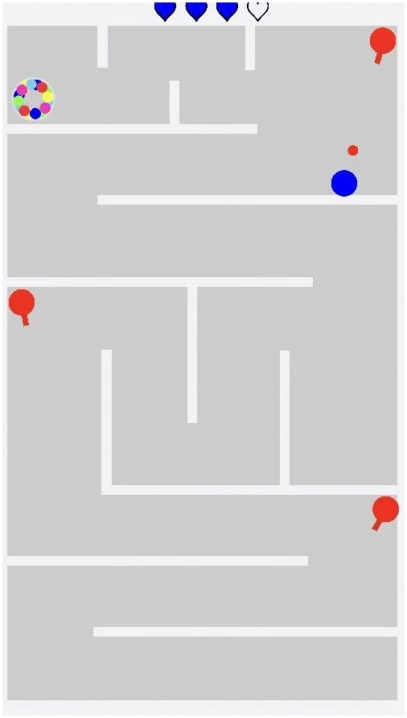
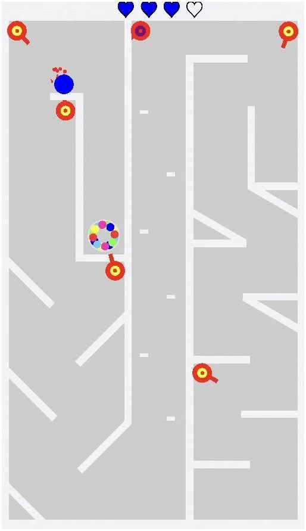
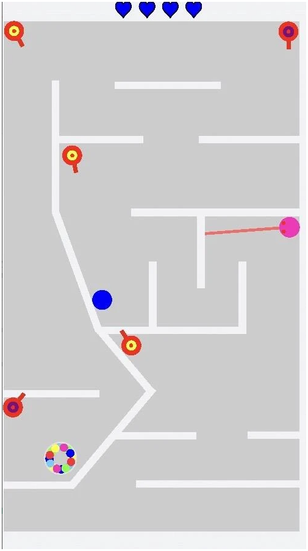

# Blue VS Colors 🎯🌈

**Android action/arcade game built with Unity.**  
Beat 10 increasingly tough levels while dodging cannon fire and outsmarting unpredictable attacks.

**▶ Play on Google Play:**  
https://play.google.com/store/apps/details?id=com.ROBED.BuleVSColors

---

## ✨ Highlights
- **10 handcrafted levels** with steadily rising difficulty.  
- **Faster cannons & unpredictable attack patterns** keep each level fresh.  
- **Skill-based dodging & smart escape routes** — stay engaged as the action intensifies.  
- **Quick sessions** designed for mobile play.

---

## 📸 Screenshots

<p align="center">
  
  
  
</p>

[](https://youtube.com/shorts/3IWRxz4Z0Mk?feature=share)

---

## 🧩 Game Overview
- **Core loop:** Navigate hazards and survive waves of cannon shots to clear each stage.  
- **Progression:** Difficulty ramps with speed and randomness; every level feels different.  
- **Goal:** Clear all 10 levels — improve consistency and reaction time.

---

## 🛠️ Tech Stack
- **Engine:** Unity (LTS recommended)  
- **Scripting:** C#  
- **Target:** Android (AAB for Play Store)  
- **Build:** IL2CPP, ARM64/ARMv7

---

## 🗂️ Repository Layout (source only)
This repository intentionally **excludes builds and secrets**.

```
Assets/             # Game code, scenes, prefabs, art (with .meta files)
ProjectSettings/    # Unity project configuration
Packages/           # manifest.json + packages-lock.json
.gitignore          # excludes Library/, Builds/, *.apk/*.aab, keystore, etc.
README.md
```

---

## 🔒 Data Safety
- **No data collected and no data shared with third parties** (per the Play Store listing).  

---

## 🙌 Credits
- **Developer:** Rayek  


---
